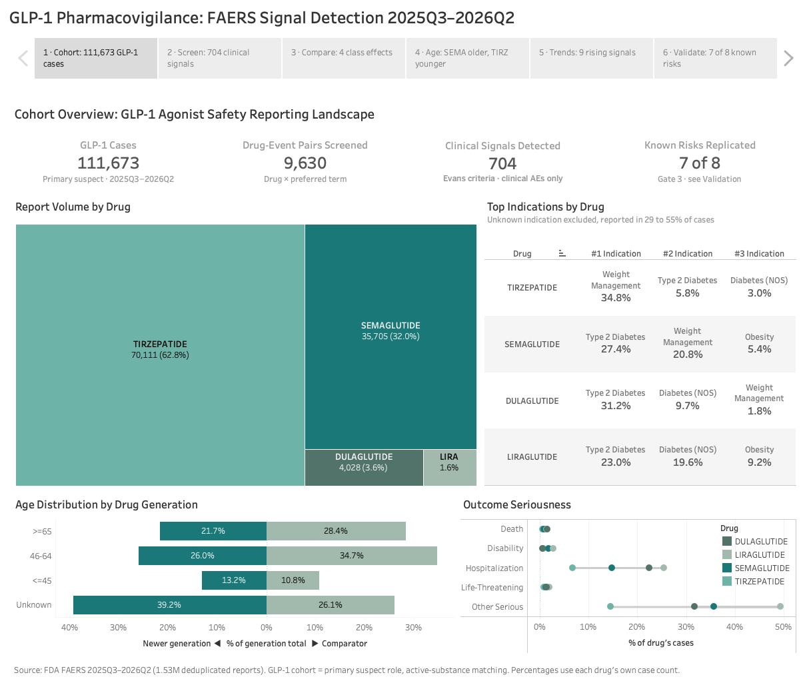

# FAERS Signal Detection: GLP-1 Receptor Agonist Safety Profiling

**[Interactive dashboard on Tableau Public](https://public.tableau.com/app/profile/hingling.yu/viz/GLP-1PharmacovigilanceFAERSSignalDetection/GLP-1FAERSSignalDetection)**



End-to-end pharmacovigilance analysis of 1.5 million FDA adverse event reports (FAERS 2025 Q3 through 2026 Q2) for four GLP-1 receptor agonists: semaglutide, tirzepatide, dulaglutide, and liraglutide. Built a disproportionality signal detection engine in SAS, validated it against known drug-reaction pairs, and applied it to produce drug-level safety profiles with quarterly time trends.

## Key Results

- **111,673 GLP-1 cases** extracted from 1.5M total FAERS reports across 4 quarters
- **127,196 Evans-flagged signals** (PRR ≥ 2, a ≥ 3, χ² ≥ 4) out of 753,594 drug-reaction pairs evaluated database-wide
- **9,630 GLP-1 drug × event pairs screened**, 811 Evans-flagged, 704 of them clinical adverse events
- **Validation: 8/8 positive controls detected, 0/6 Evans false positives** on negative controls
- **Gate 3 passed at 87.5%** (7 of 8 known label signals replicated, threshold 6 of 8)
- **NAION: detected outside the target list.** Semaglutide NAION (PT: optic ischaemic neuropathy) detected at PRR 100.0 on 625 cases. NAION was not in the pre-specified target list, and EMA PRAC concluded it is a very rare side effect of semaglutide on June 6, 2025, just before the data window opens on July 1, 2025.
- **321 emerging or accelerating signals** (264 emerging, 57 accelerating, clinical adverse events only) identified through quarter-by-quarter PRR tracking
- **27 events signal on all 4 drugs**: 23 preferred terms and 4 signal groups. The dashboard reports 4 class effects because its heatmap works at the signal-group layer: gallbladder disease, gastroparesis, pancreatitis and thyroid neoplasm, 4 of the 7 groups evaluated.

## Pipeline Overview

```
FAERS ASCII (4 quarters, 7 tables each)
        │
        ▼
┌─────────────────────────────┐
│  Phase 1.1: SAS Import      │  01_import_clean.sas
│  Dedup, DELETE filter,      │  Macro: import_faers_table.sas
│  field-width QC             │  Gate 1: row counts + dedup rate
└─────────────┬───────────────┘
              │
              ▼
┌─────────────────────────────┐
│  Phase 1.2: MySQL Warehouse │  01_ddl.sql → 02_load.sql → 03_queries.sql
│  9 tables, GLP-1 cohort     │  Materialized glp1_ps_case table
│  materialization, 20 queries│  Gate 1 re-verified in MySQL
└─────────────┬───────────────┘
              │
              ▼
┌─────────────────────────────┐
│  Phase 2: Signal Engine     │  02_signal_engine.sas
│  PRR/ROR on all 753K pairs  │  Macros: calc_prr.sas, calc_ror.sas
│  Evans + ROR flagging       │  Gate 2: 8 pos + 6 neg controls
└─────────────┬───────────────┘
              │
              ▼
┌─────────────────────────────┐
│  Phase 3: GLP-1 Deep Dive   │  7 SAS programs (03_glp1_*.sas)
│  Signal profiles, drug      │  Head-to-head, subgroup, time trend
│  comparison, time trends,   │  12-group validation reference set
│  validation                 │  Gate 3: label signal replication
└─────────────┬───────────────┘
              │
              ▼
┌─────────────────────────────┐
│  Phase 4: Tableau Dashboard │  6-page Tableau Story
│  Cohort → Screening →       │  Published on Tableau Public
│  Compare → Age → Trends →   │
│  Validation                 │
└─────────────────────────────┘
```

**Gate system:** Each phase has a pass/fail gate with pre-defined criteria. No downstream work begins until the gate clears.

## Methodology

### Disproportionality Measures

| Measure | Formula | Signal Threshold |
|---------|---------|-----------------|
| PRR | (a/[a+b]) / (c/[c+d]) | Evans: a ≥ 3, PRR ≥ 2, χ² ≥ 4 |
| ROR | (a/b) / (c/d) | Lower 95% CI > 1 |
| EBGM | Empirical Bayes geometric mean | Demoted to ranking aid (see below) |

Where a = target drug × target event, b = target drug × all other events, c = all other drugs × target event, d = all other drugs × all other events.

Every PRR in this project is computed on one denominator: the 1,529,453-case analysis universe, defined as deduplicated cases carrying both a primary-suspect drug with a named active ingredient and at least one coded preferred term.

### Validation Design

**Gate 2 (engine-level):**
- 8 positive controls: known drug-reaction pairs across pharmacological classes (statins × rhabdomyolysis, fluoroquinolones × tendon rupture, semaglutide × pancreatitis, etc.)
- 6 negative controls: known non-associations, verified sub-threshold before the run

**Gate 3 (GLP-1 application):**
A time-indexed reference set of 12 signal groups across 3 categories. Each group carries the date and the regulatory body that acted on it, and the expected result is set from that date.

- **Category A (8 groups):** Known label signals (boxed warnings, W&P), in force throughout the data window. Expected: replicated. Result: 7 of 8 replicated. The one miss is acute kidney injury, which reports below PRR 1 on all four drugs. Diabetic retinopathy replicated on 4 of 4 drugs.
- **Category C (1 group):** Investigated and closed by regulators (suicidal ideation / behaviour). Expected: not replicated. Result: semaglutide suicidal ideation scores PRR 1.43 on 176 cases and does not clear Evans, which agrees with EMA PRAC (Apr 2024) and FDA (Jan 2026). Two rarer terms in the group do clear Evans on small counts, in three drug-PT combinations: depression suicidal on semaglutide (PRR 2.74 on 11 cases) and on tirzepatide (PRR 4.71 on 33 cases), and self-injurious ideation on semaglutide (PRR 2.02 on 13 cases). The group is flagged Caution and reported as a false positive.
- **Category D (3 groups):** Recognized during or just before the data window (NAION, pulmonary aspiration, alopecia). Expected: detected. Result: 3 of 3 detected.

### EBGM Demote Decision

The empirical Bayes model converged but produced an untruncated prior mean of 17.3 (DuMouchel reference: approximately 1.04). This inflated EB05 scores, with 41.8% of EBGM "signals" coming from pairs with fewer than 3 cases. EBGM columns are retained in all output tables for reference but are not used as a gate criterion or primary signal flag. A zero-truncated refit validated against openEBGM is on the roadmap.

### GLP-1 Cohort

| Drug | Reports | Serious % | Generation |
|------|---------|-----------|------------|
| Tirzepatide | 70,111 | 19.7% | Newer |
| Semaglutide | 35,705 | 43.1% | Newer |
| Dulaglutide | 4,028 | 42.6% | Comparator |
| Liraglutide | 1,830 | 61.9% | Comparator |

Drug comparison runs at three layers: semaglutide vs. tirzepatide (head-to-head), newer generation vs. comparator generation, and a 4-drug overview. Time trends track PRR quarter by quarter and classify each drug-PT pair as emerging, accelerating, declining, stable, or inconsistent.

## Repo Structure

```
├── sas/
│   ├── 00_config.sas              # Libnames, GLP-1 drug list, Evans thresholds, formats
│   ├── 00_ref_pt_filter.sas       # PT category classification (clinical AE vs. med-error/device)
│   ├── 00_ref_pt_group.sas        # PT grouping for validation reference set
│   ├── 01_import_clean.sas        # Import 7 tables × 4 quarters, dedup, DELETE filter
│   ├── 01b_export_csv.sas         # Export CLEAN datasets to CSV for MySQL load
│   ├── 02_signal_engine.sas       # Full-database PRR/ROR/EBGM on all drug-reaction pairs
│   ├── 02_positive_controls.sas   # Gate 2: 8 positive + 6 negative controls
│   ├── 03_glp1_extract.sas        # GLP-1 cohort extraction
│   ├── 03_glp1_signal_profile.sas # Per-drug signal profiles
│   ├── 03_glp1_drug_compare.sas   # 3-layer drug comparison
│   ├── 03_glp1_subgroup.sas       # Age/sex/country stratification
│   ├── 03_glp1_time_trend.sas     # Quarter-by-quarter PRR with trend classification
│   ├── 03_glp1_validation.sas     # Gate 3: 12-group time-indexed reference set
│   ├── 03_glp1_report.sas         # 9 report tables + executive summary + 6 key findings
│   └── macros/
│       ├── import_faers_table.sas  # Parameterized import with DQ handling
│       ├── calc_prr.sas            # PRR + 95% CI + chi-square
│       └── calc_ror.sas            # ROR + 95% CI
├── sql/
│   ├── 01_ddl.sql                 # Database, users, 9 tables, indexes
│   ├── 02_load.sql                # LOAD DATA + Gate 1 verification
│   ├── 03_queries.sql             # Views, materialized cohort, 20 analytical queries
│   └── 04_reporter_type.sql       # Read-only reporter occupation check, 6 cohorts
├── python/
│   └── 01_verify_raw_widths.py    # Independent row count + field width check
├── portfolio/                     # Case study and dashboard screenshots
├── dashboard/                     # Tableau workbook spec
├── docs/                          # Specs, review notes, FDA reference material
└── output/
    ├── tables/                    # 10 report CSVs + Gate 2 control results
    ├── csv/                       # CLEAN dataset exports for MySQL
    └── qc/                        # Field width and dedup QC outputs
```

## Known Limitations

1. **EBGM prior mis-fit.** The untruncated likelihood produced unreliable shrinkage estimates. Demoted to ranking aid; a proper zero-truncated refit is planned.
2. **Coverage bias in time trends.** Semaglutide quarterly volumes are highly uneven (13,519 / 2,726 / 2,895 / 15,137), making middle-quarter PRR unmeasurable for some PTs. "Emerging" signals include both measured (confirmed sub-threshold early) and inferred (early quarters too thin to compute) types.
3. **Reporter occupation counts direct submissions only.** `sql/04_reporter_type.sql` measures who filed each report, and it confirms the mechanism behind the dulaglutide gastroparesis finding (PRR 81, 24.2% of all dulaglutide cases): lawyers filed 73.7% of those 974 cases, against 21.4% of all dulaglutide cases and 1.2% across FAERS. Semaglutide NAION is 1.9% lawyer-filed and 41.0% health-professional-filed, against 0.06% and 16.9% for all semaglutide cases. The residual limitation is what the field records. `occp_cod` marks only the reports a lawyer sent to FDA directly, so an attorney-solicited report filed by the patient or their physician is counted as a consumer or physician report and cannot be separated out; each lawyer share is a floor. Two further constraints: all four quarters fall after MDL 3094 was filed in February 2024, so this window contains no pre-litigation dulaglutide baseline, and `occp_cod` is blank on 72% of 2026Q2 cases against 17% in 2025Q3, which deflates every non-blank share in that quarter.
4. **AKI false negative.** Acute kidney injury is a labeled Warning and Precaution for all four drugs but scores below PRR 1.0 on all four. Disproportionality cannot detect a risk that is equally common across the comparator set.
5. **Single FAERS data source.** No external validation against EudraVigilance or VigiBase. Findings are FAERS-specific.

## Tech Stack

| Tool | Role |
|------|------|
| SAS (SAS OnDemand for Academics) | Data import, cleaning, deduplication, signal detection engine, GLP-1 analysis |
| MySQL | Analytical data warehouse, cohort materialization, referential integrity checks |
| Python | Independent row count and field width verification |
| Tableau | Interactive dashboard, 6-page Story (published) |

## Data

FDA FAERS Quarterly Data Extract (ASCII), 4 quarters: 2025 Q3 through 2026 Q2. Downloaded from [FDA FAERS](https://fda.gov/drugs/questions-and-answers-fdas-adverse-event-reporting-system-faers/fda-adverse-event-reporting-system-faers-latest-quarterly-data-files). Raw data not included in this repository.

## How this was built

Built in collaboration with Claude (Anthropic). Claude Code (Opus 5) in VS Code wrote the SAS, SQL and Python from specs I designed. A separate Claude session helped draft specs and reviewed methods, including the independent review that led to the EBGM demotion. I made the analysis design decisions, ran every SAS program on SAS OnDemand for Academics, and signed off each validation gate.

## Author

Hingling Yu
Columbia University, M.S. Environmental Health Data Science
[LinkedIn](https://linkedin.com/in/hinglingyu) · [Email](mailto:hingling.yu@outlook.com)
