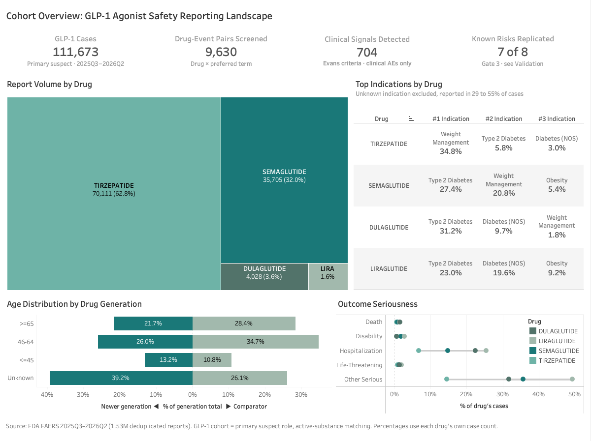
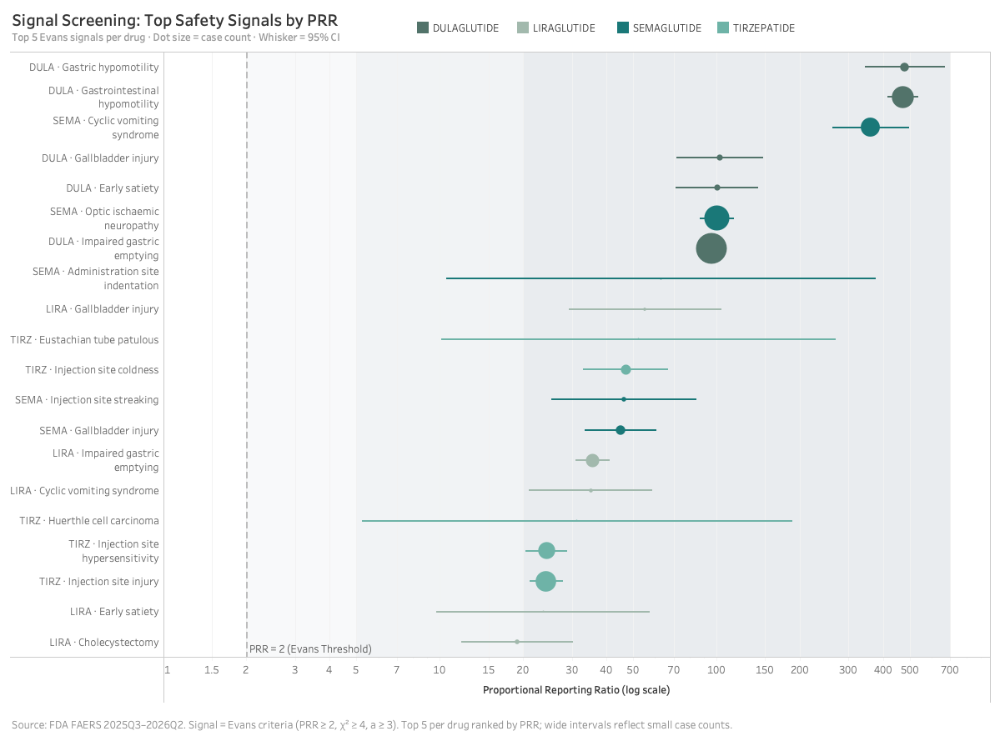
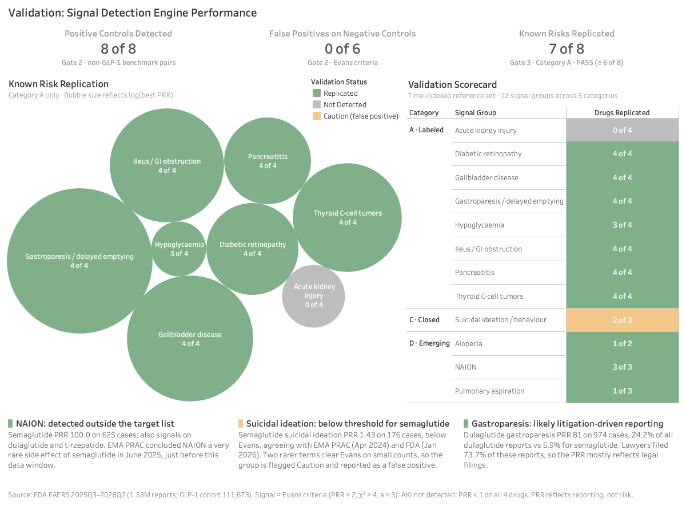
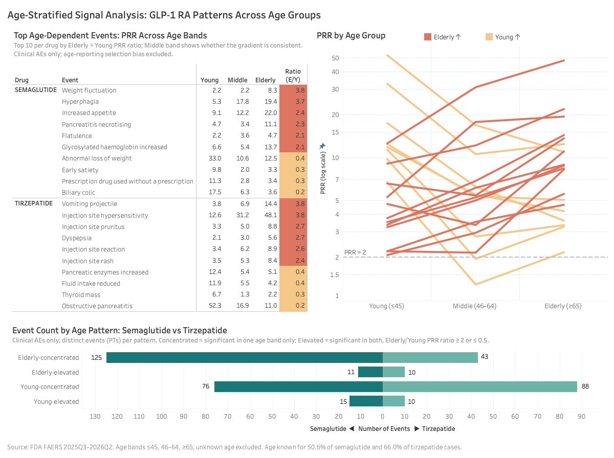
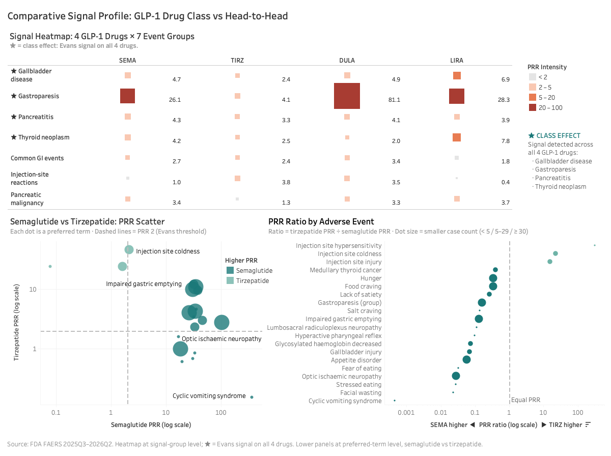
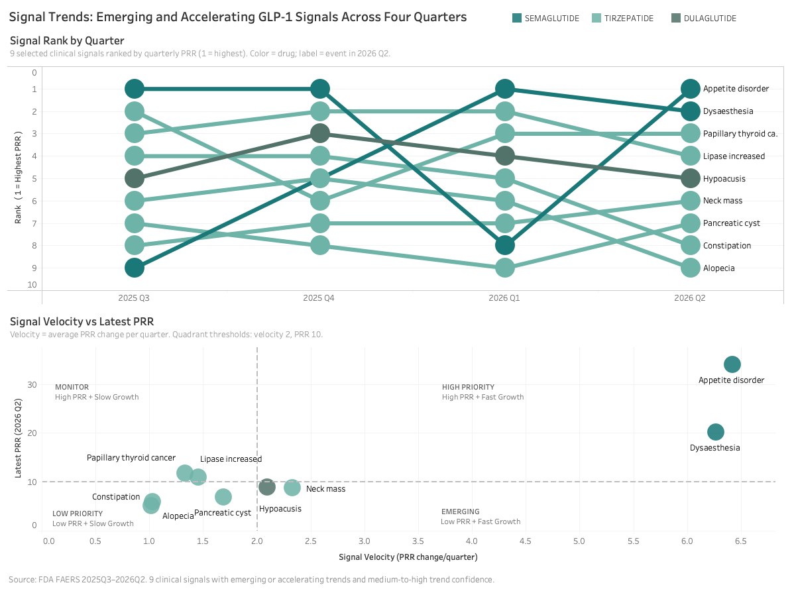

# FAERS Signal Detection: GLP-1 Safety Profiling

**[Interactive dashboard on Tableau Public](https://public.tableau.com/app/profile/hingling.yu/viz/GLP-1PharmacovigilanceFAERSSignalDetection/GLP-1FAERSSignalDetection)**

## The Problem

GLP-1 receptor agonists (Ozempic, Mounjaro, Wegovy) are prescribed for type 2 diabetes and weight management, and regulators are actively reviewing several potential adverse effects, including NAION (a rare form of optic nerve damage), suicidal ideation, and aspiration risk during anesthesia.

The FDA's Adverse Event Reporting System (FAERS) is the primary US post-marketing surveillance database, containing millions of spontaneous adverse event reports. Disproportionality analysis on FAERS data is a standard pharmacovigilance method for detecting drug-event pairs that are reported more frequently than expected.

I built a complete signal detection pipeline to analyze 1.5 million FAERS reports and produce safety profiles for four GLP-1 drugs: semaglutide, tirzepatide, dulaglutide, and liraglutide.

## What I Built

**A 3-phase pipeline running SAS, MySQL, and Python across 14 programs:**

**Phase 1: Data Ingestion.** Imported 4 quarters of FAERS ASCII data (2025 Q3 through 2026 Q2), covering 7 tables per quarter. The SAS import macro handles 10 documented data quality issues including field truncation, case versioning, and deduplication. Deduplication removed 6.93% of DEMO records (4,432 deleted cases and 109,515 duplicate case versions). Every PRR in this project is computed on one denominator: the 1,529,453 deduplicated cases that carry both a primary-suspect drug with a named active ingredient and at least one coded preferred term. The cleaned dataset was loaded into a MySQL analytical warehouse with row-count and referential-integrity verification at both the SAS and SQL layers.

*Storypoint 1 shows cohort size, report volume by drug, the top reported indications, age distribution by drug generation, and outcome seriousness.*

**Phase 2: Signal Detection Engine.** Computed Proportional Reporting Ratio (PRR) and Reporting Odds Ratio (ROR) for all 753,594 drug-reaction pairs in the database. Signals were flagged using the Evans criteria (a ≥ 3, PRR ≥ 2, χ² ≥ 4), producing 127,196 flagged pairs. I also implemented an empirical Bayes shrinkage estimate (EBGM); during validation I found the prior was mis-fit (untruncated prior mean of 17.3 vs. DuMouchel's reference of approximately 1.04), so I demoted it to a ranking aid and reported Evans+ROR counts instead.

*Storypoint 2 shows the top five Evans signals per drug as a forest plot, with PRR on a log scale and 95% confidence intervals.*

**Phase 3: GLP-1 Deep Dive.** Seven SAS programs covering signal profiling, 3-layer drug comparison (semaglutide vs. tirzepatide, newer vs. older generation, 4-drug overview), age/sex subgroup analysis, quarter-by-quarter PRR time trends, and a 12-group validation reference set. Screening 9,630 drug × event pairs in the GLP-1 cohort produced 811 Evans signals, 704 of them clinical adverse events.

## Validation

The pipeline uses a 3-gate validation system. No downstream analysis runs until the preceding gate clears.

**Gate 1 (data integrity):** Row counts verified independently by SAS and Python. Field widths checked for truncation (33 at FDA source cap, 0 truncated by the pipeline). Dedup rate within the expected 5 to 15% range.

**Gate 2 (engine accuracy):** 8 positive controls drawn from established pharmacological signals (statins and rhabdomyolysis, fluoroquinolones and tendon rupture, semaglutide and pancreatitis, among others). All 8 detected. 6 negative controls drawn from known non-associations. 0 Evans false positives (1 ROR false positive on methotrexate and insomnia, which clears ROR's lower-CI test while failing Evans).

**Gate 3 (GLP-1 application):** A time-indexed reference set of 12 signal groups across 3 categories. Each group carries the date and the regulatory body that acted on it, and the expected result is set from that date.

- **Category A, 8 labeled risks in force throughout the window.** 7 of 8 replicated (87.5%, threshold 6 of 8). The one miss is acute kidney injury, which reports below PRR 1 on all four drugs. Diabetic retinopathy replicated on 4 of 4 drugs.
- **Category C, 1 risk investigated and closed: suicidality, not detected for semaglutide.** Semaglutide suicidal ideation scores PRR 1.43 on 176 cases and does not clear Evans, which agrees with EMA PRAC (Apr 2024) and FDA (Jan 2026). Two rarer terms in the group do clear Evans on small counts (depression suicidal on tirzepatide, PRR 4.71 on 33 cases; self-injurious ideation on semaglutide, PRR 2.02 on 13 cases), so the group is flagged Caution and reported as a false positive.
- **Category D, 3 signals newly recognized inside the window.** NAION, pulmonary aspiration and alopecia: 3 of 3 detected.

*Storypoint 6 shows the Gate 2 and Gate 3 results, the 12-group validation scorecard, and the three findings discussed below.*

## Selected Findings

### 1. NAION: detected outside the target list

The engine flagged optic ischaemic neuropathy for semaglutide at PRR 100.0 on 625 cases, and the same PT also signals on dulaglutide and tirzepatide. NAION was not in the pre-specified target list. EMA PRAC concluded NAION is a very rare side effect of semaglutide in June 2025, inside this data window. Because each reference group is scored against what regulators knew on its own date, a signal recognized in June 2025 is tested against the state of knowledge before that date.

### 2. Injection-Site Separation Between the Two Newer Drugs

Tirzepatide: PRR 3.8 on 10,111 cases, 14.4% of its cohort. Semaglutide: PRR 1.00 on 1,518 cases, 4.3%, which sits on the FAERS background rate. Device, formulation, and injection-frequency differences are candidate explanations; this data cannot separate them.

### 3. Gastroparesis: likely litigation-driven reporting

Gastroparesis PTs account for 24.2% of all dulaglutide reports (PRR 81), against 5.9% for semaglutide. US gastroparesis litigation naming dulaglutide ran across this data window. The PRR reflects reporting volume, so it should not be read as a comparative risk ranking.

### 4. Age-Dependent Signal Patterns

Among elderly semaglutide users (≥ 65), PRR for increased appetite is 2.4x higher than in the ≤ 45 group (21.96 vs. 9.09). Injection-site hypersensitivity for tirzepatide shows a similar elderly elevation at 3.8x (PRR 48.1 vs. 12.6). Age is reported for 50.6% of semaglutide cases and 66.0% of tirzepatide cases, and the subgroup analysis compares each event's own age coverage against its drug's baseline. Increased appetite (42.2%) and injection-site hypersensitivity (77.4%) both fall within 15 percentage points of their drug's baseline, so neither gradient rests on a differently selected subset of cases.

*Storypoint 4 shows the top age-dependent events per drug, PRR across the three age bands, and the count of events by age pattern.*

### 5. 27 Candidate Class Effects

27 events are flagged as Evans signals on all 4 drugs: 23 preferred terms and 4 signal groups (gallbladder disease, gastroparesis, pancreatitis, thyroid neoplasm). The dashboard reports 4 class effects because its heatmap works at the signal-group layer, where 4 of the 7 groups signal on all four drugs. Running four drugs against a common comparator separates class-level patterns from drug-specific ones, and a signal present on all four is consistent with a class-level effect.

*Storypoint 3 shows the 4-drug by 7-group signal heatmap, plus the semaglutide vs. tirzepatide PRR scatter and PRR ratio at preferred-term level.*

## Lessons and Next Steps

**EBGM requires careful fitting.** I implemented the DuMouchel empirical Bayes model, found the untruncated likelihood inflated the prior mean to 17x the reference value, and demoted it to a ranking aid. Fixing it properly requires a zero-truncated refit and validation against openEBGM.

**Evans criteria are sensitive on small counts.** In the suicidal ideation group (Category C), the primary term scores below threshold on semaglutide (PRR 1.43 on 176 cases), while two rarer terms in the same group clear Evans on 13 and 33 cases. Evans sets its case-count floor at a ≥ 3, so a rare term with a handful of reports can pass it. Any presentation of results needs to state that.

**Coverage bias matters.** Semaglutide quarterly volumes vary from 2,726 to 15,137 cases. Many "emerging" signals are inferred from thin early quarters instead of measured against a confirmed sub-threshold baseline. The trend classification separates the two types, and a consumer of the results needs to know which type a given signal is.

*Storypoint 5 shows quarterly PRR rank for nine selected clinical signals and each signal's velocity against its latest PRR.*

**Litigation distorts spontaneous reporting.** Gastroparesis on dulaglutide is the clearest example. Without reporter occupation or legal-case metadata, which this pipeline does not carry through to the GLP-1 cohort, the mechanism can only be stated as a limitation.

## Technical Summary

| Dimension | Detail |
|-----------|--------|
| Data | FDA FAERS 2025 Q3 through 2026 Q2; 1,529,453-case analysis universe (deduplicated cases with a primary-suspect drug and at least one coded PT) |
| GLP-1 cohort | 111,673 cases across 4 drugs |
| Signal engine | PRR + ROR on 753,594 drug-reaction pairs |
| Evans signals | 127,196 flagged database-wide; 811 in the GLP-1 cohort, 704 clinical adverse events |
| Validation | 8/8 positive, 0/6 false positive (Evans), Gate 3 at 87.5% |
| Time trends | 321 emerging or accelerating signals (264 emerging, 57 accelerating, clinical adverse events only) |
| Programs | 14 SAS + 3 SQL + 1 Python |
| Dashboard | 6-storypoint Tableau Story, published on Tableau Public |
| Tools | SAS (SAS OnDemand for Academics), MySQL, Python, Tableau |

## Author

Hingling Yu
Columbia University, M.S. Environmental Health Data Science
